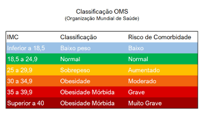

# calculadora-de-custo-benefecio-de-planos-de-saude
É comum entre pessoas físicas e empresas a busca por planos de saúde com bom custo-benefício. Para facilitar a escolha do melhor plano de saúde, foi requisitado ao time de desenvolvimento da empresa X a criação de uma calculadora de custo-benefício de planos de saúde. Esta ferramenta irá comparar as ofertas de duas operadoras de saúde, denominadas A e B.

⦁	Regras de Negócio da Operadora de Saúde A:

⦁	Plano básico: preço é igual a 100 + (idade * 10 * (IMC / 10)).
⦁	Plano standard: preço é igual a (150 + (idade * 15)) * (IMC / 10).
⦁	Plano premium: preço é igual a (200 - (IMC * 10) + (idade * 20)) * (IMC / 10).

⦁	Regras de Negócio da Operadora de Saúde B:

Esta operadora considera o fator de comorbidade com base no IMC:

⦁	Fator de comorbidade:
⦁	10 se IMC for abaixo do peso.
⦁	1 se IMC for normal.
⦁	6 se IMC for sobrepeso.
⦁	10 se IMC for obesidade.
⦁	20 se IMC for obesidade mórbida grave.
⦁	30 se IMC for obesidade mórbida muito grave.

Preços dos planos:
⦁	Plano básico: preço é igual a 100 + (fator de comorbidade * 10 * (IMC / 10)).
⦁	Plano standard: preço é igual a (150 + (fator de comorbidade * 15)) * (IMC / 10).
⦁	Plano premium: preço é igual a (200 - (IMC * 10) + (fator de comorbidade * 20)) * (IMC / 10).

Comparação e Determinação do Plano Mais Vantajoso:

A calculadora deve comparar os preços dos planos básico, standard e premium de ambas as operadoras para determinar o plano mais vantajoso com base em critérios como menor preço. Exiba um extrato dos valores dos planos para que ele tenha uma visão geral dos preços (em uma tabela, por exemplo).

Esta ferramenta permitirá ao usuário inserir sua idade, peso e altura para calcular automaticamente os preços dos planos de saúde das duas operadoras, fornecendo assim uma recomendação sobre qual plano pode ser mais vantajoso de acordo com as regras estabelecidas.

OBS: Considerando que este é o trabalho final, não esqueça de estilizar sua página, além de deixá-la responsiva (isso vale 2 pontos). É obrigatório a separação dos tipos de linguagens em HTML, JS e CSS. A utilização dos componentes visuais do Bootstrap também serão vistos como boa prática.